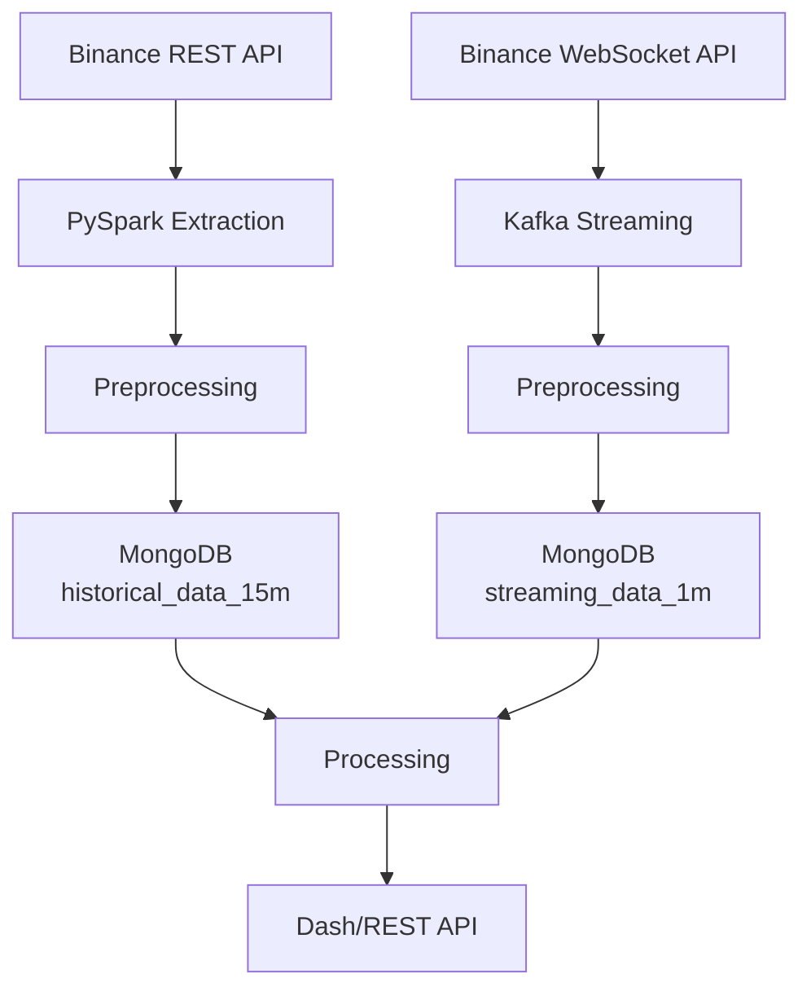

[](https://github.com/siobhan-doherty/crypto-bot/actions/workflows/build-and-test.yml)
[](https://github.com/siobhan-doherty/crypto-bot/actions/workflows/codeql.yml)
[](https://www.python.org/downloads/release/python-3110/)
[](https://github.com/psf/black)

# Binance Crypto Bot – Production Data Pipeline

**Binance CryptoBot** is a microservices‑based platform that ingests **historical** (via Binance REST API) and **real‑time** (via Binance WebSocket) cryptocurrency data from [Binance](https://www.binance.com/) (BTC/USDT and ETH/USDT). It processes the data and serves it through a REST API (FastAPI) and an interactive dashboard (Dash). The project demonstrates a full-lifecycle data engineering pipeline, from raw data ingestion to dashboard analytics. Built using Docker, Apache Airflow, Apache Kafka, MongoDB, FastAPI & Dash.

## 📖 Table of Contents

- [Architecture](#architecture--components)
- [Quick Start](#quick-start)
- [Key Features](#key-features)
- [Testing & Quality](#testing--quality)
- [CI/CD](#cicd)
- [Project Structure](#project-structure)
- [License & Authors](#license--authors)

## 🧱 Architecture & Components



### Main Services

The platform runs two independent pipelines (both served by FastAPI & Dash): 
- **batch** (historical REST -> PySpark -> MongoDB) and
- **streaming** (WebSocket -> Kafka -> MongoDB)

| Service                    | Port   | Role                               |
|----------------------------|--------|------------------------------------|
| `crypto_airflow`           | 8080   | Airflow web UI & DAG scheduler     |
| `crypto_fastapi`           | 8000   | REST API (historical + streaming)  |
| `crypto_dash`              | 8050   | Interactive Plotly dashboard       |
| `crypto_kafka`             | 9092   | Message broker                     |
| `crypto_mongo`             | 27017  | Primary data store                 |
| `kafka_producer`           | -      | Binance WebSocket -> Kafka         |
| `kafka_consumer`           | -      | Kafka -> MongoDB                   |
| `crypto_data_collector`    | -      | Spark, batch & streaming scripts   |
| `zookeeper`                | 2181   | Kafka manager                      |
| `crypto_postgres`          | 5432   | Airflow metadata store             |

All services except `crypto_data_collector` include Docker healthchecks.

## 🚀 Quick Start

### 1. Clone & set up environment variables

```bash
git clone https://github.com/siobhan-doherty/crypto-bot
cd crypto-bot
cp .env.example .env               # edit with your secrets
cp src/collection_admin/.env.example src/collection_admin/.env
cp src/api_user/.env.example src/api_user/.env
```

### Required variables

See `.env.example` in each folder for the full list of required variables:

- **Root `.env`** – MongoDB credentials, Airflow config (incl. Fernet key), Airflow admin user.
- **`src/collection_admin/.env`** – MongoDB URI, Binance API key/secret.
- **`src/api_user/.env`** – MongoDB URI.

Generate a Fernet key for Airflow:

```bash
python -c "from cryptography.fernet import Fernet; print(Fernet.generate_key().decode())"
```

### 2. Build and run the full stack

```bash
docker compose build
docker compose up -d
```

### 3. Access the services

- Airflow UI → http://localhost:8080
- FastAPI docs → http://localhost:8000/docs
- Dash dashboard → http://localhost:8050

### 4. Run batch and streaming jobs

- **Batch (historical)** – Trigger Airflow DAG `initialize_historical_data` (one‑time)  
  - DAG `update_historical_data` runs daily at midnight (or manually)
- **Streaming (real‑time)** – Kafka producer/consumer start automatically with Docker Compose  
  - Monitor logs: `docker logs crypto_kafka_producer` / `docker logs crypto_kafka_consumer`

### 5. Manual execution inside the data collector container
```bash
# Load 3–6 months of 15‑minute data
docker exec -it crypto_data_collector python /app/src/collection_admin/data/initialize_historical_data.py

# Update with new 15‑minute candles
docker exec -it crypto_data_collector python /app/src/collection_admin/data/update_historical_data.py

# Start Kafka producer (1‑minute data)
docker exec -it crypto_data_collector python /app/src/collection_admin/data/kafka_producer.py

# Start Kafka consumer
docker exec -it crypto_data_collector python /app/src/collection_admin/data/kafka_consumer.py
```

## Key Features

| Feature | Description |
|---------|-------------|
| **Historical Data** | 6 months of 15‑minute interval price data via Binance REST API, ingested with PySpark |
| **Real‑Time Data** | 1‑minute market data streamed via Binance WebSocket → Kafka → MongoDB |
| **Incremental Extraction** | Fetches every 15‑minute interval since the last successful extraction |
| **Airflow Orchestration** | `initialize_historical_data` (one‑off) and `update_historical_data` (daily) DAGs |
| **Streaming Pipeline** | Kafka producer + consumer with automatic container restart |
| **API & Dashboard** | FastAPI for data access + Dash interactive charts (candlestick, line, volume, volatility) |

## Testing & Quality

```bash
# Unit + integration tests (excludes e2e)
pytest tests/ --cov=src --cov-report=term

# End‑to‑end test (spins up Kafka, MongoDB, FastAPI, consumer)
bash scripts/run-e2e.sh

# Pre‑commit hooks (auto‑fixes style, imports, lint, types)
pre-commit install
pre-commit run --all-files
```
- Code quality tools: isort, black, ruff, mypy, bandit, pytest, pytest-cov, pre-commit
Coverage target: ≥50% (increasing)

## CI/CD
```markdown

GitHub Actions runs on every push and pull request to `master`:

- **Linting & formatting:** `isort`, `black`, `ruff`
- **Security scanning:** `bandit` + CodeQL
- **Static type checking:** `mypy`
- **Unit tests:** all tests except e2e, with 50% coverage threshold
- **End‑to‑end test:** spins up a dedicated Docker Compose stack (Kafka, Zookeeper, MongoDB, FastAPI, consumer) to validate the full streaming pipeline
```

## Project Structure

```text
airflow/dags/               # Airflow DAGs (historical data)
src/
├── api_user/               # FastAPI + Dash + schemas
├── collection_admin/       # Kafka, mongo_utils, historical scripts
tests/
├── integration/            # Docker‑compose for end-to-end test
├── test_e2e_pipeline.py    # Full streaming pipeline test
└── conftest.py             # Mocks & fixtures
scripts/
└── run-e2e.sh              # Testing end-to-end pipeline stack
```

Licensed under the [Apache License 2.0](./LICENSE).

Built with ❤️ by Team A – DataScientest Bootcamp Data Engineer Project (April 2025)
* Indira Burga, Katharina Klat, Siobhan Doherty
---
