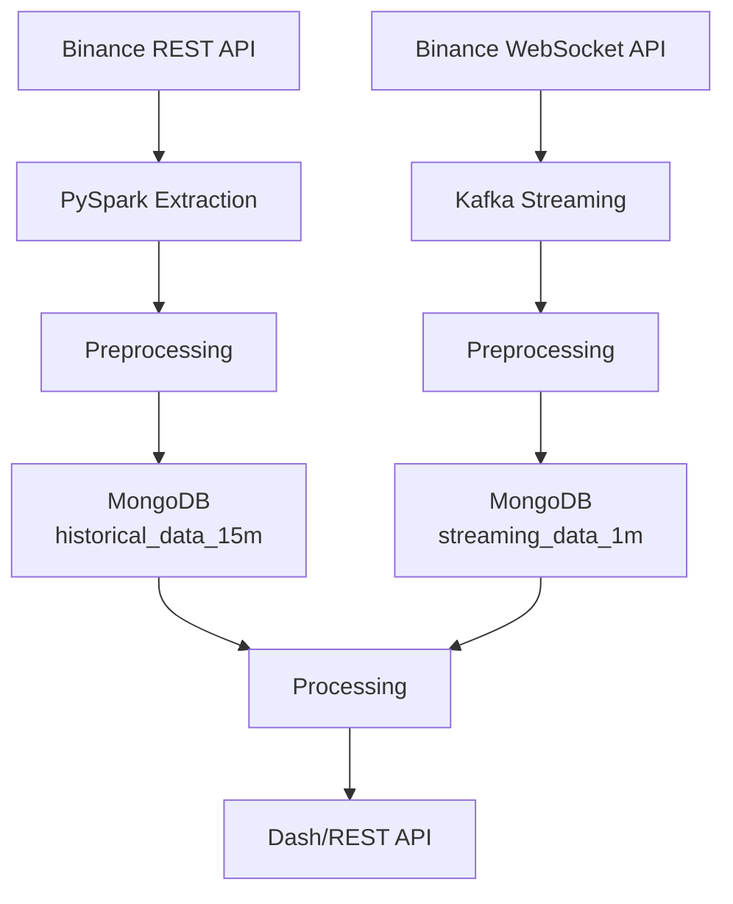

[](https://github.com/siobhan-doherty/crypto-bot)
[](https://github.com/siobhan-doherty/crypto-bot/actions/workflows/build-and-test.yml)
[](https://github.com/siobhan-doherty/crypto-bot/actions/workflows/codeql.yml)
[](https://www.python.org/downloads/release/python-3110/)
[](https://github.com/psf/black)

# Binance Crypto Bot – Production Data Pipeline

**Binance CryptoBot** is a microservices‑based platform that ingests **historical** (via Binance REST API) and **real‑time** (via Binance WebSocket) cryptocurrency data from [Binance](https://www.binance.com/) (BTC/USDT and ETH/USDT). It processes the data and serves it through a REST API (FastAPI) and an interactive dashboard (Dash). The project demonstrates a full-lifecycle data engineering pipeline, from raw data ingestion to dashboard analytics.

Built using **Docker**, **Apache Airflow**, **Apache Kafka**, **MongoDB**, **FastAPI** & **Dash**.

## 📖 Table of Contents

- [Architecture & Components](#architecture--components)
- [Multi‑Exchange Alert System](#multi-exchange-alert-system)
- [Quick Start](#quick-start)
- [Key Features](#key-features)
- [Testing & Quality](#testing--quality)
- [CI/CD](#cicd)
- [Project Structure](#project-structure)
- [License & Authors](#license--authors)

## 🧱 Architecture & Components


```mermaid
flowchart TD
    A[Binance REST API] --> B[PySpark Extraction]
    B --> C[Preprocessing]
    C --> D[MongoDB<br>historical_data_15m]
    E[Binance WebSocket API] --> F[Kafka Streaming]
    F --> G[Preprocessing]
    G --> H[MongoDB<br>streaming_data_1m]
    D --> I[Processing]
    H --> I
    I --> J[Dash/REST API]
```

| Pipeline | Description |
|----------|-------------|
| **Batch** | Historical REST -> PySpark -> MongoDB |
| **Streaming** | WebSocket -> Kafka -> MongoDB |
| **Alerts** | Multi-exchange monitoring -> Sentiment -> Telegram |

| Service | Port | Role |
|---------|------|------|
| `crypto_airflow` | 8080 | Airflow web UI & DAG scheduler |
| `crypto_fastapi` | 8000 | REST API (historical + streaming) |
| `crypto_dash` | 8050 | Interactive Plotly dashboard |
| `crypto_kafka` | 9092 | Message broker |
| `crypto_mongo` | 27017 | Primary data store |
| `crypto_price_alerts` | 8080 | Alert engine health check |
| `kafka_producer` | - | Binance WebSocket -> Kafka |
| `kafka_consumer` | - | Kafka -> MongoDB |
| `crypto_data_collector` | - | Spark, batch & streaming scripts |
| `zookeeper` | 2181 | Kafka manager |
| `crypto_postgres` | 5432 | Airflow metadata store |

All services include Docker healthchecks.

## 🧠 Multi-Exchange Alert System

A **production‑grade price alert engine** that monitors multiple exchanges in real time.

### Architecture

```
┌─────────────────┐    ┌──────────────────┐    ┌─────────────────┐
│  Binance API    │    │    Kraken API    │    │    Bybit API    │
└────────┬────────┘    └────────┬─────────┘    └────────┬────────┘
         │                      │                       │
         └──────────────────────┼───────────────────────┘
                                ▼
                    ┌───────────────────────┐
                    │  Exchange Wrapper     │
                    │  (CCXT + Fallback)    │
                    └───────────┬───────────┘
                                ▼
                    ┌───────────────────────┐
                    │  Price Alert Engine   │
                    │  - Threshold checks   │
                    │  - Cooldown logic     │
                    │  - Duplicate prevent  │
                    └───────────┬───────────┘
                                ▼
                    ┌───────────────────────┐
                    │  Sentiment Enrichment │
                    │  Mistral AI (primary) │
                    │  Hugging Face (fallback)│
                    └───────────┬───────────┘
                                ▼
                    ┌───────────────────────┐
                    │  Telegram Notifier    │
                    └───────────────────────┘
```

### Alert Configuration

Alerts are defined in `alerts.json`:

```json
[
    {"symbol": "BTC/USDT", "exchange": "binance", "threshold": 70000.0, "condition": "above"},
    {"symbol": "BTC/USDT", "exchange": "kraken", "threshold": 60000.0, "condition": "below"},
    {"symbol": "ETH/USDT", "exchange": "bybit", "threshold": 4000.0, "condition": "above"}
]
```

Each alert specifies:
- **Symbol** – trading pair (e.g., `BTC/USDT`)
- **Exchange** – which exchange to monitor (`binance`, `kraken`, `bybit`)
- **Threshold** – price level in USDT
- **Condition** – `above` or `below`

### Sentiment Analysis

Alerts are enriched with sentiment using:
1. **Mistral AI** (primary) – fast, accurate, low-latency
2. **Hugging Face** (fallback) – free tier, activated if Mistral fails

**Example Telegram Alert:**
```
Price Alert!
Symbol: ETH/USDT
Exchange: binance
Current: $1,762.62
Threshold: $3,500.00 (below)
Time: 2026-07-04 12:49:06 UTC

🧠 Sentiment (mistral): bullish (0.92)
📊 Pattern: Breakout (bullish) – cluster 0
```

### Pattern Detection

The alert engine includes **real‑time pattern detection**:
- **Feature Extraction** – statistical features (mean, std, skew, kurtosis) + technical indicators (RSI, MACD)
- **Embedding** – PCA reduces feature space to 8 dimensions
- **Clustering** – HDBSCAN groups similar patterns into regimes
- **Alert Enrichment** – detected patterns are added to Telegram messages

### Cost Tracking

Estimated costs per provider are logged every 10 requests:
```
INFO:src.alerts.price_alert:Cost summary (mistral): 10 requests, 250 tokens, $0.0001
```

## 🚀 Quick Start

### 1. Clone & set up environment variables

```bash
git clone https://github.com/siobhan-doherty/crypto-bot
cd crypto-bot
cp .env.example .env               # edit with your secrets
cp src/collection_admin/.env.example src/collection_admin/.env
cp src/api_user/.env.example src/api_user/.env
```

### Required variables

See `.env.example` in each folder for the full list:

| File | Variables |
|------|-----------|
| **Root `.env`** | MongoDB credentials, Airflow config (incl. Fernet key), Airflow admin user |
| **`src/collection_admin/.env`** | MongoDB URI, Binance API key/secret |
| **`src/api_user/.env`** | MongoDB URI |

Generate a Fernet key for Airflow:
```bash
python -c "from cryptography.fernet import Fernet; print(Fernet.generate_key().decode())"
```

### 2. Build and run the full stack

```bash
docker compose build
docker compose up -d
```

### 3. Access the services

| Service | URL |
|---------|-----|
| Airflow UI | [http://localhost:8080](http://localhost:8080) |
| FastAPI docs | [http://localhost:8000/docs](http://localhost:8000/docs) |
| Dash dashboard | [http://localhost:8050](http://localhost:8050) |
| Alert health | [http://localhost:8080/health](http://localhost:8080/health) |

### 4. Run data pipelines

- **Batch (historical)** – Trigger Airflow DAG `initialize_historical_data` (one‑time)
- DAG `update_historical_data` runs daily at midnight (or manually)
- **Streaming (real‑time)** – Kafka producer/consumer start automatically with Docker Compose
- Monitor logs: `docker logs crypto_kafka_producer` / `docker logs crypto_kafka_consumer`

### 5. Manual execution inside the data collector container

```bash
# Load 3–6 months of 15‑minute data
docker exec -it crypto_data_collector python /app/src/collection_admin/data/initialize_historical_data.py

# Update with new 15‑minute candles
docker exec -it crypto_data_collector python /app/src/collection_admin/data/update_historical_data.py

# Start Kafka producer (1‑minute data)
docker exec -it crypto_data_collector python /app/src/collection_admin/data/kafka_producer.py

# Start Kafka consumer
docker exec -it crypto_data_collector python /app/src/collection_admin/data/kafka_consumer.py
```

### 6. Run the alert engine

```bash
# Locally
PYTHONPATH=. python scripts/run_alerts.py

# Or via Docker
docker compose up -d price_alerts
docker logs -f crypto_price_alerts
```

### 7. Train pattern detection models

```bash
# Uses historical data from MongoDB (falls back to synthetic if none)
PYTHONPATH=. python scripts/run_pattern_training.py
```

## ✨ Key Features

| Feature | Description |
|---------|-------------|
| **Historical Data** | 6 months of 15‑minute interval price data via Binance REST API, ingested with PySpark |
| **Real‑Time Data** | 1‑minute market data streamed via WebSocket → Kafka → MongoDB |
| **Incremental Extraction** | Fetches every 15‑minute interval since the last successful extraction |
| **Airflow Orchestration** | `initialize_historical_data` and `update_historical_data` DAGs |
| **Streaming Pipeline** | Kafka producer + consumer with automatic container restart |
| **API & Dashboard** | FastAPI REST endpoints + Dash interactive charts (candlestick, line, volume, volatility) |
| **Multi‑Exchange Price Alerts** | Monitor **Binance**, **Kraken**, and **Bybit** with configurable thresholds |
| **Dual‑Provider Sentiment** | **Mistral AI** (primary) + **Hugging Face** (fallback) |
| **Pattern Detection** | **PCA embedding + HDBSCAN clustering** of price patterns |
| **Latency & Cost Tracking** | Logs sentiment latency and estimated API costs |
| **Production‑Grade Testing** | Comprehensive unit + integration tests |
| **CI/CD Pipeline** | GitHub Actions: linting, security, typing, unit tests, E2E tests |

## 🧪 Testing & Quality

```bash
# Unit + integration tests (excludes e2e)
pytest tests/ --cov=src --cov-report=term

# End‑to‑end test (spins up Kafka, MongoDB, FastAPI, consumer)
bash scripts/run-e2e.sh

# Pre‑commit hooks (auto‑fixes style, imports, lint, types)
pre-commit install
pre-commit run --all-files
```

**Code quality tools:** `isort`, `black`, `ruff`, `mypy`, `bandit`, `pytest`, `pytest-cov`, `pre-commit`

**Coverage target:** ≥50% (increasing)

---

## 🔄 CI/CD

GitHub Actions runs on every push and pull request to `master`:

| Stage | Tools |
|-------|-------|
| **Linting & formatting** | `isort`, `black`, `ruff` |
| **Security scanning** | `bandit` + CodeQL |
| **Static type checking** | `mypy` |
| **Unit tests** | all tests except E2E, with coverage threshold |
| **End‑to‑end test** | Dedicated Docker Compose stack validates the full streaming pipeline | 

---

## 📁 Project Structure

```
crypto-bot/
├── airflow/
│   └── dags/                    # Airflow DAGs (historical data)
├── src/
│   ├── alerts/                  # ⭐ Price alert engine
│   │   ├── sentiment/           # Mistral AI + Hugging Face providers
│   │   ├── config.py            # Pydantic settings
│   │   ├── models.py            # Alert data models
│   │   ├── notifier.py          # Telegram integration
│   │   └── price_alert.py       # Main alert engine
│   ├── api_user/                # FastAPI + Dash + schemas
│   ├── collection_admin/        # Kafka, mongo_utils, historical scripts
│   ├── exchange_wrapper/        # ⭐ Multi‑exchange CCXT wrapper
│   └── pattern_analytics/       # ⭐ Pattern detection (PCA + HDBSCAN)
├── scripts/
│   ├── run_alerts.py            # ⭐ Alert engine entry point
│   ├── run_e2e.sh               # Testing end‑to‑end pipeline
│   └── run_pattern_training.py  # ⭐ Pattern model training
├── tests/
│   ├── integration/             # Docker‑compose for E2E test
│   ├── test_alert_system.py     # ⭐ Alert engine tests
│   ├── test_e2e_pipeline.py     # Full streaming pipeline test
│   └── conftest.py              # Mocks & fixtures
├── alerts.json                  # ⭐ Alert configuration
├── docker-compose.yml
├── Dockerfile.alerts            # ⭐ Alert service container
└── README.md
```

## 🤝 Contributors

Built with ❤️ by Team A – DataScientest Bootcamp Data Engineer Project (April 2025)
* Indira Burga, Katharina Klat, Siobhan Doherty

---

## 📄 License

Licensed under the [Apache License 2.0](https://github.com/siobhan-doherty/crypto-bot/blob/master/LICENSE).
